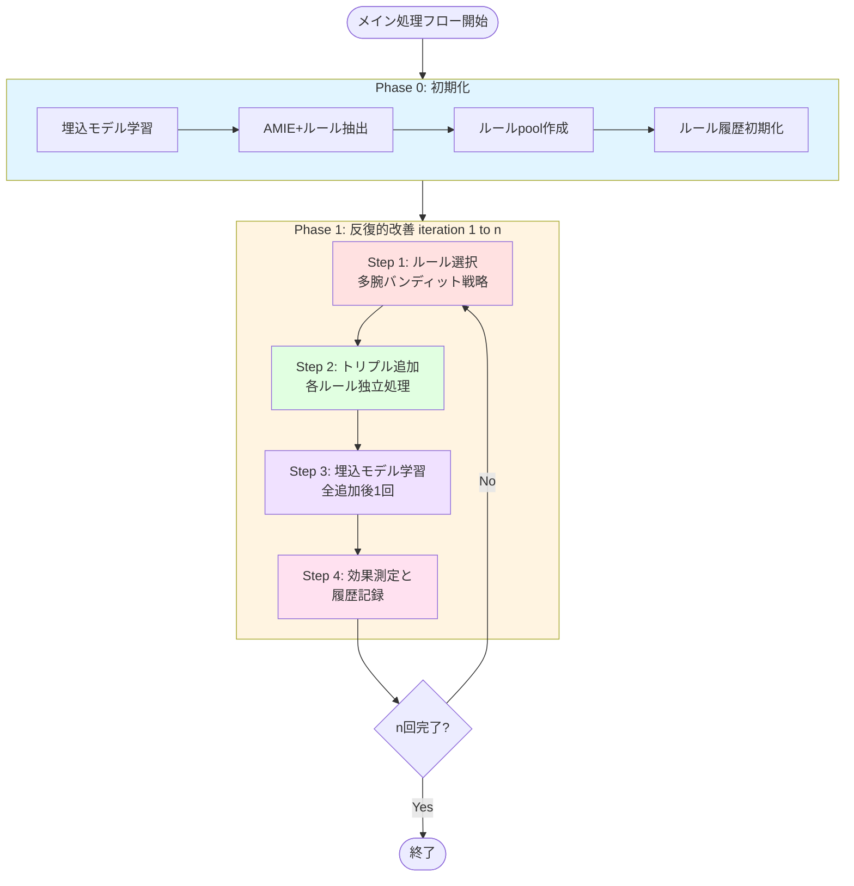

# LLM Knowledge Refiner

知識グラフ埋込モデルとLLM（Large Language Model）を組み合わせた、知識グラフの品質向上システム

---

## 目次

- [概要](#概要)
- [主要機能](#主要機能)
- [システムアーキテクチャ](#システムアーキテクチャ)
- [環境構築](#環境構築)
- [使用方法](#使用方法)
  - [main.py - メイン実行スクリプト](#mainpy---メイン実行スクリプト)
  - [make_test_dataset.py - テストデータセット生成](#make_test_datasetpy---テストデータセット生成ツール)
- [ディレクトリ構造](#ディレクトリ構造)
- [設定ファイル](#設定ファイル)
- [開発情報](#開発情報)
- [関連ドキュメント](#関連ドキュメント)

---

## 概要

本プロジェクトは、知識グラフの品質向上を目的とした研究プロジェクトです。知識グラフ埋込モデル（PyKEEN）とLLM（GPT-4o）を組み合わせ、外部情報源から知識を取得して知識グラフを段階的に改善します。

知識グラフの品質は、埋め込みモデルの精度（Hit@k等の指標）で測定され、反復的な改善プロセスを通じて向上します。

### 主要な特徴

- **反復的改善**: 埋込モデルの学習 → ルール選択 → 情報取得 → トリプル追加のサイクルを繰り返す
- **多腕バンディット戦略**: ルールpoolから効果的なルールを選択し、探索と活用のバランスを取る
- **LLM活用**: ルール生成・選択、外部情報の取得・検証にLLMを活用
- **品質重視**: スコアベースのフィルタリングにより、確実性の高いトリプルのみを追加

---

## 主要機能

### 知識グラフ埋込モデル学習
- PyKEENを用いた知識グラフ埋込モデル（TransE, DistMult等）の学習
- トリプルの尤もらしさスコアの計算
- GPU対応による高速学習

### ルール抽出・生成
- AMIE+による頻出パターン（Hornルール）の抽出
- LLMによるルール生成と更新
- ルール品質指標（confidence, head coverage等）による自動フィルタリング

### 多腕バンディット戦略によるルール選択
- LLMポリシー駆動型選択: 履歴を分析してLLMが戦略的に選択
- UCB（Upper Confidence Bound）: 信頼上限に基づく選択
- Epsilon-Greedy: ランダム探索と活用のバランス

### 外部情報取得
- GPT-4oのWeb検索機能を用いた外部情報取得
- Hornルールに基づくパターンマッチングと知識抽出
- 構造化された知識の自動抽出

### テストデータセット生成
- ターゲットエンティティ周辺の文脈トリプルを制御的に削除
- 知識補完の効果を測定するための合成データセット生成

---

## システムアーキテクチャ



詳細なアーキテクチャとモジュール説明は[Agents.md](./Agents.md)を参照してください。

---

## 環境構築

### 必要要件

- Python 3.8以上
- CUDA対応GPU（オプション、推奨）
- Java 8以上（AMIE+実行用）
- OpenAI API Key

### インストール

```bash
# リポジトリのクローン
git clone <repository-url>
cd <repository-name>

# 依存パッケージのインストール
pip install -r requirements.txt
```

### 環境変数の設定

本プロジェクトは機密情報を環境変数で管理します。実行前に以下の変数を設定してください。

| 変数名 | 必須 | 説明 |
|---|---|---|
| `OPENAI_API_KEY` | 必須 | OpenAI APIキー。GPT-4o（ルール生成・選択）、Embeddings（KG検索）、Web Search（外部情報取得）に使用。 |

```bash
# シェルで設定する場合
export OPENAI_API_KEY="sk-..."

# .envファイルで管理する場合（dotenvなどを使用）
echo 'OPENAI_API_KEY=sk-...' > .env
```

> **注意**: `settings.py` は `os.getenv("OPENAI_API_KEY", "")` で環境変数から読み込みます。  
> APIキーをソースコードに直接記述しないでください。

### Dockerを使用する場合

```bash
# CPU版
docker-compose up

# GPU版
docker-compose -f docker-compose-gpu.yml up
```

---

## 使用方法

---

## KG-FIT（TAKG対応KGE）の最短手順

KG-FITバックエンドは、事前計算した「テキスト埋め込み」と「seed階層（クラスタ＋近傍クラスタ）」を用いて、KGE学習に正則化（anchor/cohesion/separation）を追加する。
学習時に外部APIを叩かない（事前計算のみ OpenAI embeddings を利用）前提で運用する。

事前条件:
- データセットディレクトリ（`<DATASET_DIR>`）に `train.txt`（TSV: head, relation, tail）がある
- テキスト付与用に `entity2text.txt`（推奨）と `entity2textlong.txt`（任意）がある
- `OPENAI_API_KEY` が設定済み（事前計算で必要）

### 1) テキスト埋め込みの事前計算（`.cache/kgfit/` を生成）

```bash
python3 scripts/compute_kgfit_text_embeddings.py \
  --dir_triples <DATASET_DIR> \
  --model text-embedding-3-small \
  --dtype float32 \
  --batch_size 128
```

生成物（既定）:
- `<DATASET_DIR>/.cache/kgfit/entity_name_embeddings.npy`
- `<DATASET_DIR>/.cache/kgfit/entity_desc_embeddings.npy`
- `<DATASET_DIR>/.cache/kgfit/entity_embedding_meta.json`

### 2) seed階層の構築（クラスタ中心＋近傍クラスタ）

```bash
python3 scripts/build_kgfit_seed_hierarchy.py \
  --dir_triples <DATASET_DIR> \
  --reshape_strategy full \
  --neighbor_k 5
```

生成物（既定）:
- `<DATASET_DIR>/.cache/kgfit/hierarchy_seed.json`
- `<DATASET_DIR>/.cache/kgfit/cluster_embeddings.npy`
- `<DATASET_DIR>/.cache/kgfit/neighbor_clusters.json`

### 3) KG-FITバックエンドでKGE学習

`config_embeddings_kgfit.json` は、`<DATASET_DIR>/.cache/kgfit/` を前提にした汎用の学習設定例。

```bash
python3 scripts/train_initial_kge.py \
  --dir_triples <DATASET_DIR> \
  --output_dir <MODEL_OUT_DIR> \
  --embedding_config config_embeddings_kgfit.json \
  --num_epochs 100
```

仕様（再実装の根拠）:
- KG-FITバックエンド標準: [docs/rules/RULE-20260119-TAKG_KGFIT-001.md](docs/rules/RULE-20260119-TAKG_KGFIT-001.md)
- 正則化/近傍K運用: [docs/rules/RULE-20260119-KGFIT_REGULARIZER_SPEEDUP-001.md](docs/rules/RULE-20260119-KGFIT_REGULARIZER_SPEEDUP-001.md)

## main.py - メイン実行スクリプト

### 処理の概要

`main.py`は、多腕バンディット戦略を用いたルール選択による知識グラフ改善のメインスクリプトです。

**目的**: 
- 知識グラフ埋込モデルの精度を反復的に向上させる
- 効果的なルールを選択して知識グラフにトリプルを追加する
- ルールの効果を測定し、選択戦略を改善する

**基本的なアイデア**:
1. **初期化フェーズ（Iteration 0）**:
   - 初期データセットで埋込モデルを学習
   - AMIE+で頻出パターン（Hornルール）を抽出
   - 抽出したルールから品質指標に基づいて初期ルールpool（n個）を作成
   - ルール履歴管理システムを初期化

2. **反復的改善フェーズ（Iteration 1 to n）**:
   - **ルール選択**: 多腕バンディット戦略（LLMポリシー、UCB、Epsilon-Greedy等）でpoolからk個選択
   - **トリプル追加**: 各選択ルールで独立したtarget tripleセットに対してトリプル追加
   - **モデル学習**: 全トリプル追加後に埋込モデルを1回学習（効率化）
   - **効果測定**: 各ルールのスコア変化を分析し履歴に記録
   - **戦略改善**: 履歴情報を活用して次回の選択戦略を改善

**多腕バンディット戦略**:
- ルールpoolを「腕（arm）」と見なし、各iterationで最も効果的な腕を選択
- 履歴情報を基に、探索（新しいルールを試す）と活用（効果的なルールを使う）のバランスを取る
- ルールpool自体は固定し、選択戦略のみを改善（標準的な多腕バンディット設定）

---

### アルゴリズムフロー

#### Phase 0: 初期化

```python
# Step 0.1: 初期埋込モデル学習
kge_initial = KnowledgeGraphEmbedding.train_model(
    dir_triples=dir_iter_0,
    model='TransE',
    num_epochs=100
)

# Step 0.2: AMIE+ルール抽出
amie_rules = extract_rules_from_entire_graph(
    kge_initial,
    target_relation='/people/person/nationality',
    min_pca_conf=0.1,
    min_head_coverage=0.01
)

# Step 0.3: 初期ルールpool作成
rule_pool = rule_generator.create_initial_rule_pool_from_amie(
    amie_rules=amie_rules,
    n_rules=10,
    sort_by='pca_conf'  # 信頼度の高いルールを優先
)

# Step 0.4: ルール履歴初期化
rule_history = RuleHistory()
rule_selector = create_rule_selector(
    strategy='llm_policy',  # または 'ucb', 'epsilon_greedy'
    history=rule_history
)
```

#### Phase 1: 反復的改善（各iteration）

```python
for i in range(1, n_iter + 1):
    # Step 1: ルール選択（多腕バンディット）
    selected_rules, policy = rule_selector.select_rules(
        rule_pool,
        k=n_rules_select,
        iteration=i
    )
    
    # Step 2: 各ルールでトリプル追加（累積）
    added_triples_by_rule = {}
    used_target_triples = set()
    
    for rule_with_id in selected_rules:
        # このルール用のtarget tripleをサンプリング（重複なし）
        target_triples = sample_target_triples(
            all_target_triples,
            n_targets_per_rule,
            exclude_triples=used_target_triples
        )
        used_target_triples.update(target_triples)
        
        # トリプル追加
        added_triples, details = add_triples_for_single_rule(
            dir_triples=dir_current,
            rule=rule_with_id.rule,
            target_triples=target_triples
        )
        
        added_triples_by_rule[rule_id] = {
            'rule': rule,
            'target_triples': target_triples,
            'added_triples': added_triples
        }
    
    # Step 3: 埋込モデル学習（全追加後に1回）
    kge_next = KnowledgeGraphEmbedding.train_model(
        dir_triples=dir_next,
        model='TransE',
        num_epochs=100
    )
    
    # Step 4: 各ルールの評価と履歴記録
    analyzer = RuleWiseAnalyzer(
        kge_before=kge_current,
        kge_after=kge_next
    )
    
    for rule_id, rule_data in added_triples_by_rule.items():
        evaluation_record = analyzer.create_evaluation_record(
            iteration=i,
            rule_id=rule_id,
            rule=rule_data['rule'],
            target_triples=rule_data['target_triples'],
            added_triples=rule_data['added_triples']
        )
        rule_history.add_record(evaluation_record)
    
    # ルールpoolは固定（多腕バンディットの標準設定）
    # 履歴情報は選択戦略の改善に使用される
```

---

### 処理の詳細

#### 初期ルールpool作成（AMIE+ベース）

AMIE+で抽出されたHornルールから、品質指標に基づいて初期ルールpoolを作成します。

**選択基準**:
- `pca_conf` (PCA confidence): ルールの信頼度
- `head_coverage`: ルールがカバーするheadエンティティの割合
- `support`: ルールのサポート数

```python
rule_pool = rule_generator.create_initial_rule_pool_from_amie(
    amie_rules=amie_rules,
    n_rules=10,
    sort_by='pca_conf'  # 上位10個を選択
)
```

**利点**:
- 実データに基づく頻出パターンを活用
- LLM生成より知識グラフ内のパターンとマッチしやすい
- 品質指標による客観的な選択

#### ルール選択戦略

**1. LLMポリシー駆動型（`llm_policy`）**

LLMが履歴を分析して戦略的に選択：

```python
rule_selector = create_rule_selector(
    strategy='llm_policy',
    history=rule_history,
    temperature=0.3  # 低いほど決定論的
)
```

**特徴**:
- 履歴全体を自然言語で分析
- 各ルールの成績、傾向、文脈を考慮
- 選択理由をMarkdownレポートとして出力
- 創造的な選択戦略の探索

**2. UCB（Upper Confidence Bound）**

信頼上限に基づく選択：

```python
rule_selector = create_rule_selector(
    strategy='ucb',
    history=rule_history,
    c=2.0  # 探索パラメータ
)
```

**選択基準**:
$$
\text{UCB}(i) = \bar{x}_i + c \sqrt{\frac{\ln n}{n_i}}
$$

- $\bar{x}_i$: ルール$i$の平均報酬（スコア改善度）
- $n_i$: ルール$i$の選択回数
- $n$: 総選択回数
- $c$: 探索係数（大きいほど探索を重視）

**3. Epsilon-Greedy**

ランダム探索と活用のバランス：

```python
rule_selector = create_rule_selector(
    strategy='epsilon_greedy',
    history=rule_history,
    epsilon=0.1  # 10%の確率でランダム選択
)
```

#### トリプル追加処理

各選択ルールに対して独立したtarget tripleセットをサンプリングし、トリプルを追加：

```python
# ルールごとに重複しないtarget tripleをサンプリング
target_triples_for_rule = sample_target_triples(
    all_target_triples,
    n_targets_per_rule=5,
    exclude_triples=used_target_triples
)

# Hornルールに基づいてトリプル追加
added_triples, details = add_triples_for_single_rule(
    dir_triples=dir_current,
    rule=rule,
    target_triples=target_triples_for_rule
)
```

**処理の流れ**:
1. ルールのbodyパターンと知識グラフをマッチング
2. パターンを満たすトリプルを発見
3. 不足している変数を外部情報源（Web検索）から取得
4. 新しいトリプルを推論・生成
5. 知識グラフに追加

**トリプル追加失敗時の処理**:
- トリプルが追加されなかったルールにはペナルティスコア（-10.0）を記録
- 最大3回まで再選択を試行
- 成功ルールと失敗ルールを除外して新しいルールを選択

#### 効果測定と履歴記録

トリプル追加前後の埋込モデルを比較し、各ルールの効果を測定：

```python
analyzer = RuleWiseAnalyzer(
    kge_before=kge_current,
    kge_after=kge_next
)

evaluation_record = analyzer.create_evaluation_record(
    iteration=i,
    rule_id=rule_id,
    rule=rule,
    target_triples=target_triples,
    added_triples=added_triples
)
```

**評価指標**:
- `mean_score_change`: 平均スコア変化
- `std_score_change`: スコア変化の標準偏差
- `positive_changes`: スコアが向上したトリプル数
- `negative_changes`: スコアが低下したトリプル数
- `n_added_triples`: 追加されたトリプル数

**履歴データ構造**:
```python
{
    "iteration": 1,
    "rule_id": "rule_003",
    "mean_score_change": 0.0234,
    "std_score_change": 0.0156,
    "positive_changes": 4,
    "negative_changes": 1,
    "n_added_triples": 12
}
```

---

### パラメータ設定

#### スクリプト内パラメータ

スクリプトの`if __name__ == '__main__':`セクションで設定：

| パラメータ | 型 | デフォルト | 説明 |
|----------|-----|-----------|------|
| `knowledge_graph` | str | `'FB15k-237'` | 知識グラフ名 |
| `target_relation` | str | `'/people/person/nationality'` | ターゲットリレーション |
| `dir_initial_triples` | str | - | 初期データセットのディレクトリ |
| `n_iter` | int | `5` | iteration数 |
| `dir_working` | str | - | 作業ディレクトリ |
| `n_rules_pool` | int | `15` | ルールpool サイズ |
| `n_rules_select` | int | `5` | 各iterationで選択するルール数 |
| `n_targets_per_rule` | int | `10` | 各ルールのtarget triple数 |
| `rule_selector_strategy` | str | `'llm_policy'` | ルール選択戦略 |
| `llm_temperature` | float | `0.3` | LLMの創造性（0-1） |

#### AMIE+設定

| パラメータ | 型 | デフォルト | 説明 |
|----------|-----|-----------|------|
| `use_amie_rules` | bool | `True` | AMIE+を使用するか |
| `min_head_coverage` | float | `0.01` | 最小head coverage |
| `min_pca_conf` | float | `0.1` | 最小PCA confidence |
| `k_neighbor` | int | `1` | k-hop囲い込みグラフのk |
| `lower_percentile` | int | `80` | 高スコアトリプルの下限パーセンタイル |

#### 埋込モデル設定

`config_embeddings.json`で設定：

```json
{
  "model": "TransE",
  "model_kwargs": {
    "embedding_dim": 100
  },
  "training_kwargs": {
    "num_epochs": 100,
    "batch_size": 128
  }
}
```

KG-FITバックエンドを使う場合:
- `embedding_backend: "kgfit"` と `kgfit` ブロックを含む設定を使う
- 例: [config_embeddings_kgfit.json](config_embeddings_kgfit.json), [config_embeddings_kgfit_fb15k237.json](config_embeddings_kgfit_fb15k237.json)

---

### 出力ファイル

各iterationのディレクトリ（`experiments/{date}/try{n}/iter_{i}/`）に以下のファイルが生成されます：

| ファイル名 | 内容 |
|-----------|------|
| `train.txt` | 更新された訓練データ |
| `valid.txt` | 検証データ |
| `test.txt` | テストデータ |
| `model/` | 学習済み埋込モデル |
| `amie_rules.csv` | 抽出されたAMIE+ルール（iter_0のみ） |
| `rule_pool.pkl` | ルールpool（pickle形式） |
| `rule_pool.csv` | ルールpool（CSV形式） |
| `rule_additions.json` | 各ルールの追加詳細 |
| `rule_history.pkl` | ルール履歴（pickle形式） |
| `rule_history.json` | ルール履歴（JSON形式） |
| `rule_history_summary.md` | 履歴サマリーレポート |
| `selection_policy_iter{i}.md` | 選択ポリシーレポート（LLMポリシーの場合） |

#### `rule_additions.json`の構造

```json
{
  "rule_001": {
    "target_triples": [["/m/06b0d2", "/people/person/nationality", "/m/09c7w0"]],
    "added_triples": [
      ["/m/06b0d2", "/people/person/profession", "/m/02hrh1q"],
      ["/m/02hrh1q", "/award/award_winner", "/m/06b0d2"]
    ],
    "n_targets": 10,
    "n_added": 25
  },
  "rule_003": {
    ...
  }
}
```

#### `rule_history_summary.md`の構造

```markdown
# Rule Performance History

## Overall Statistics
- Total iterations: 5
- Total rules evaluated: 25
- Total triples added: 347

## Per-Rule Summary

### rule_001
- Times selected: 3
- Mean score change: 0.0234 ± 0.0156
- Total triples added: 75
- Success rate: 80% (4/5 positive changes)

### rule_003
- Times selected: 2
- Mean score change: 0.0187 ± 0.0123
- Total triples added: 48
- Success rate: 70% (7/10 positive changes)

...
```

---

### 利用例

#### 例1: 基本的な使用（LLMポリシー、5 iteration）

```bash
python main.py
```

**デフォルト設定**:
- Knowledge Graph: FB15k-237
- Target Relation: `/people/person/nationality`
- Strategy: LLM Policy
- Iterations: 5
- Rule pool size: 15
- Rules per iteration: 5

**期待される動作**:
1. 初期埋込モデル学習
2. AMIE+でルール抽出
3. 品質指標に基づいて15個のルールpoolを作成
4. 各iterationでLLMが履歴を分析して5個選択
5. 選択されたルールでトリプル追加
6. 効果測定と履歴記録

#### 例2: UCB戦略を使用

```python
# main.pyのパラメータ設定セクションを変更
rule_selector_strategy = 'ucb'
n_iter = 10
n_rules_select = 3
```

UCB戦略で10 iteration実行し、各iterationで3個のルールを選択。

#### 例3: 大規模実験（20ルールpool、10 iteration）

```python
# パラメータ設定
n_rules_pool = 20
n_rules_select = 8
n_targets_per_rule = 20
n_iter = 10
```

#### 例4: 別の知識グラフとリレーション

```python
knowledge_graph = 'WN18RR'
target_relation = '/_hypernym'
dir_initial_triples = './data/WN18RR'
dir_working = './experiments/20251213/wn18rr_hypernym'
```

---

### 実装の説明

#### 多腕バンディットの設計

**標準的な多腕バンディット設定**:
- **腕（arm）**: ルールpool内の各ルール（固定）
- **行動（action）**: 各iterationでk個のルールを選択
- **報酬（reward）**: 選択されたルールのスコア改善度
- **目標**: 累積報酬を最大化する選択戦略を学習

**本実装の特徴**:
1. **ルールpoolは固定**: iterationを通じてルールの追加・削除・変更なし
2. **選択戦略が進化**: 履歴情報を基に選択の質が向上
3. **複数ルール同時選択**: k-armed banditの拡張（k個同時選択）
4. **文脈情報の活用**: LLMポリシーは履歴全体を文脈として利用（Contextual Bandit）

#### ペナルティメカニズム

トリプルが追加されなかったルールには自動的にペナルティを記録：

```python
if len(added_triples) == 0:
    penalty_record = RuleEvaluationRecord(
        iteration=i,
        rule_id=rule_id,
        rule=rule,
        target_triples=target_triples,
        added_triples=[],
        score_changes=[0.0] * len(target_triples),
        mean_score_change=-10.0,  # 大きなペナルティ
        std_score_change=0.0,
        positive_changes=0,
        negative_changes=len(target_triples)
    )
    rule_history.add_record(penalty_record)
```

これにより、効果のないルールの選択確率が下がります。

#### 再選択メカニズム

失敗したルールを検出し、自動的に再選択：

```python
max_reselection_attempts = 3

for attempt in range(max_reselection_attempts):
    # ルール処理
    for rule_with_id in rules_to_process:
        added_triples, details = add_triples_for_single_rule(...)
        
        if len(added_triples) == 0:
            failed_rules.append(rule_with_id)
    
    # 失敗ルールがあれば再選択
    if failed_rules and attempt < max_reselection_attempts - 1:
        excluded_rule_ids = {r.rule_id for r in failed_rules + successful_rules}
        available = [r for r in rule_pool if r.rule_id not in excluded_rule_ids]
        
        reselected, _ = rule_selector.select_rules(available, k=len(failed_rules))
        rules_to_process = reselected
```

---

## make_test_dataset.py - テストデータセット生成ツール

## make_test_dataset.py - テストデータセット生成ツール

### 処理の概要

`make_test_dataset.py`は、知識グラフからターゲットエンティティ周辺の文脈トリプルを制御的に削除することで、合成テストデータセットを生成するツールです。

**目的**: 
- ターゲットリレーション $r_t$ のトリプルのもっともらしさスコアを検証する
- 限られた情報（削除された文脈）からターゲットリレーションを推論できるかを評価する
- Hornルールによる知識補完の効果を測定する

**基本的なアイデア**:
1. ターゲットエンティティ $T \subseteq E$ とターゲットリレーション $r_t \in R$ を選択
2. ターゲットエンティティの**全近傍**を収集し、その一部（$\rho$ の割合）を選択 → $R$
3. 選択された近傍 $R$ に関連する**すべてのトリプル**（ターゲットリレーションを含む）を削除
   - 例: 受賞歴、職業、教育機関、nationalityなど（**ローカルな文脈**）
   - `include_target=True`により、選択された近傍のnationalityも自然に削除される
4. ターゲットエンティティ $T$ のターゲットリレーショントリプル自体は保持（スコア検証対象）
   - 例: ターゲット人物のnationalityトリプル

この設計により、「選択された近傍の情報を削除し、削除された情報をHornルールと外部情報源から復元できるか」を評価できる環境を作成します。選択されなかった近傍（30%）のnationalityトリプルは自然に保持され、ルールのbodyパターンマッチに利用できます。

---

### 処理の詳細

#### 数学的定義

知識グラフ $G = (E, R, \mathcal{G})$ が与えられたとします。ここで：
- $E$ はエンティティ集合
- $R$ はリレーション集合
- $\mathcal{G} \subseteq E \times R \times E$ はトリプル集合

データは通常、$(\mathcal{G}_{\text{train}}, \mathcal{G}_{\text{valid}}, \mathcal{G}_{\text{test}})$ に分割されています。

#### パラメータ

- $r_t \in R$: **ターゲットリレーション**（例: `/people/person/nationality`）
- $T \subseteq E$: **ターゲットエンティティ集合**（検証対象となる人物等）
- $B \in \{\text{train}, \text{valid}, \text{test}\}$: **ベース分割**（通常は train）
- $P \in \{\text{head}, \text{tail}\}$: **ターゲット位置**（ターゲットエンティティがトリプルのどちら側か）
- $Q \in \{\text{head}, \text{tail}, \text{both}\}$: **削除方向**（削除する近傍の方向）
- $\rho \in [0, 1]$: **削除率**（`drop_ratio`）

#### アルゴリズム

**ステップ1: ターゲットトリプルの抽出**

$$
S = \{(h, r_t, t) \in \mathcal{G}_B \mid (P=\text{head} \land h \in T) \lor (P=\text{tail} \land t \in T)\}
$$

これらのトリプルは削除せず、もっともらしさスコアの検証対象として保持します。

**ステップ2: 近傍エンティティの収集**

各ターゲットエンティティ $e \in T$ について、非ターゲットリレーションを経由した近傍エンティティを収集：

$$
N_{\text{in}}(e) = \{u \mid (u, r, e) \in \mathcal{G}_B, r \neq r_t\}
$$
$$
N_{\text{out}}(e) = \{v \mid (e, r, v) \in \mathcal{G}_B, r \neq r_t\}
$$

削除方向 $Q$ に応じて使用する近傍を決定：
- $Q = \text{head}$ → $N_{\text{in}}(e)$ を使用
- $Q = \text{tail}$ → $N_{\text{out}}(e)$ を使用
- $Q = \text{both}$ → $N_{\text{in}}(e) \cup N_{\text{out}}(e)$ を使用

全ターゲットエンティティの近傍を結合：

$$
N = \bigcup_{e \in T} N_*(e)
$$

**重要**: この $N$ には友人、同僚、受賞作品など、ターゲットと**直接繋がるすべてのエンティティ**が含まれます。

削除率 $\rho$ に基づいてサンプリング（部分的な情報削除）：

$$
R \subseteq N, \quad |R| \approx \rho \cdot |N|
$$

例: $\rho = 0.7$ の場合、近傍の70%を選択、残り30%は選択されない。

**ステップ3: 削除トリプル集合の構築**

選択された近傍エンティティ $R$ に関連する**すべてのトリプル**（ターゲットリレーションを含む）を削除対象とする：

$$
D = \{(h, r, t) \in \mathcal{G}_B \mid (h \in R \lor t \in R) \land ((h \notin T \land t \notin T) \lor r \neq r_t)\}
$$

条件の意味：
- $(h \in R \lor t \in R)$: 選択された近傍エンティティを含むトリプル
- $(h \notin T \land t \notin T)$: ターゲットエンティティを含まない（スコア検証対象を保持）
- $r \neq r_t$: または、非ターゲットリレーション

実装上は`include_target=True`パラメータにより、以下のシンプルな条件で表現：

$$
D = \{(h, r, t) \in \mathcal{G}_B \mid h \in R \lor t \in R\}
$$

これにより、選択された近傍のnationalityトリプルも自然に削除されます。選択されなかった近傍（$N \setminus R$、30%）のnationalityトリプルは保持され、Hornルールのbodyパターンマッチに利用できます。

**ステップ4: 新データセットの生成**

$$
\mathcal{G}'_B = \mathcal{G}_B \setminus D
$$

他の分割（valid, test）は、削除されたエンティティに関連するトリプルを除去してそのままコピー。

#### データ設計の意図

**ターゲットエンティティ選択の改善**:
1. **最小トリプル数フィルタ** (`min_target_triples=5`):
   - 極端に文脈の少ないエンティティを除外
   - トリプル数が5未満のエンティティはターゲットとして選択されない
   - これにより、ルールが適用できる十分な情報を持つエンティティのみを選択

2. **相互近傍関係の除外と補充**:
   - あるターゲットエンティティが別のターゲットの近傍になっている場合、一方を除外
   - **除外した数だけ新しい候補を自動補充**し、所定の数を維持
   - 例: 100個選択 → 8個除外 → 8個補充 → 最終的に100個を確保
   - これにより、D1の削除により完全に情報が失われるケースを回避
   - トリプル数の少ない方を優先的に除外し、情報豊富なエンティティを保持
   - 最大10回の反復処理で、すべての相互近傍関係を解消

**トリプルの扱い**:
1. **ターゲットトリプル $S$**: 保持（train.txtに残す）
   - これは「正解」として保持し、埋め込みモデルのスコアを検証する
   - 例: `/m/06b0d2 --nationality--> /m/09c7w0`

2. **選択された近傍の情報 $D$**: 削除（train_removed.txtに移動）
   - 選択された近傍のすべてのトリプル（受賞歴、職業、教育機関、nationalityなど）
   - この情報をHornルールと外部情報源から復元できるかをテスト
   - ターゲットエンティティの**選択された1-hop近傍** ($R$、70%）の完全な情報

3. **選択されなかった近傍の情報**: 保持（train.txtに残る）
   - 選択されなかった近傍（$N \setminus R$、30%）のすべてのトリプル
   - これらは自然にtrain.txtに残り、Hornルールのbodyパターンマッチに利用できる
   - 例: `?f nationality ?b ∧ ?a friend ?f => ?a nationality ?b`
     - `?f`が選択されなかった友人の場合、`?a friend ?f`と`?f nationality ?b`の両方がtrain.txtに残る
     - `?f`が選択された友人の場合、両方が削除され、外部情報源から取得する必要がある

#### なぜこの設計が有効か？

**ステップ2のサンプリング**（$\rho = 0.7$）により：
- 70%の近傍情報は完全に削除（$R$ に含まれる）→ すべてのトリプルを失う
- 30%の近傍情報は完全に保持（$N \setminus R$）→ すべてのトリプルが残る

**ルール適用の流れ**:

```
?f nationality ?b ∧ ?a friend ?f => ?a nationality ?b
```

1. ターゲット`?a`の友人`?f`を特定
   - `?f \in R`（選択された近傍、70%）: 友人関係は削除済み、外部情報源から取得必要
   - `?f \in N \setminus R`（選択されなかった近傍、30%）: 友人関係が保持されている

2. `?f`のnationalityを知る
   - `?f \in R`: nationality は削除済み（外部情報源から取得必要）
   - `?f \in N \setminus R$: nationality は保持されている（そのまま利用可能）

3. ルールを適用して`?a`のnationalityを推論
   - 選択されなかった友人（30%）の情報があれば、そのまま推論可能
   - 選択された友人（70%）の情報は外部から取得して推論

つまり、**部分的な情報削除**により、「一部の情報は保持、一部は削除されて外部取得が必要」という現実的なシナリオを再現します。`include_target=True`により、選択された近傍のnationalityが自然に削除されることで、ルールによる知識補完の効果を適切に測定できます。

---

### 実装の説明

#### コマンドライン引数

| 引数 | 型 | 必須 | デフォルト | 説明 |
|------|-----|------|-----------|------|
| `--dir_triples` | str | ✓ | - | 元の知識グラフデータのディレクトリ |
| `--dir_test_triples` | str | ✓ | - | 生成するテストデータセットの出力先 |
| `--target_relation` | str | ✓ | - | ターゲットリレーション（例: `/people/person/nationality`） |
| `--config` | str | | `./config_dataset.json` | 設定ファイルパス |
| `--base_triples` | str | | `train` | ベース分割（train/valid/test） |
| `--target_entities` | str | | `-` | ターゲットエンティティ（ファイルパスまたはカンマ区切り） |
| `--auto_target_entities` | int | | `0` | 自動選択するターゲットエンティティ数 |
| `--min_target_triples` | int | | `5` | ターゲットエンティティに必要な最小トリプル数（文脈フィルタ） |
| `--target_preference` | str | | `head` | ターゲット位置（head/tail） |
| `--remove_preference` | str | | `both` | 削除方向（head/tail/both） |
| `--drop_ratio` | float | | `0.7` | 近傍の削除率 [0, 1] |
| `--include_target` | bool | | `true` | 選択エンティティのターゲットリレーションも削除するか |
| `--remove_target_incidents` | bool | | `false` | `true`の場合、近傍ではなく**ターゲットエンティティ自身**にincidentなトリプルを削除（ただしtarget_triplesは保持） |
| `--seed` | int | | `42` | 乱数シード |

#### 主要関数

**`parse_entities(spec: str) -> List[str]`**
- **引数**: 
  - `spec`: ファイルパスまたはカンマ区切りエンティティリスト
- **戻り値**: エンティティIDのリスト
- **処理**: ファイルの場合は1行1エンティティ、それ以外はカンマ区切りでパース

**`pick_neighbors(base, target_entities, target_relation, remove_preference) -> Set[str]`**
- **引数**:
  - `base`: ベース分割のトリプルリスト
  - `target_entities`: ターゲットエンティティ集合
  - `target_relation`: ターゲットリレーション
  - `remove_preference`: 削除方向（head/tail/both）
- **戻り値**: 近傍エンティティ集合 $N$
- **処理**: 非ターゲットリレーションを経由した近傍エンティティを収集

**`select_subset(items, ratio, rng) -> Set[str]`**
- **引数**:
  - `items`: アイテムリスト
  - `ratio`: サンプリング率 [0, 1]
  - `rng`: 乱数生成器
- **戻り値**: サンプリングされたアイテム集合
- **処理**: 指定した割合でランダムサンプリング

**`compute_deletions(base, selected_entities, target_relation, include_target) -> List[Triple]`**
- **引数**:
  - `base`: ベース分割のトリプルリスト
  - `selected_entities`: 削除対象近傍エンティティ集合 $R$
  - `target_relation`: ターゲットリレーション
  - `include_target`: 選択エンティティのターゲットリレーションも削除するか（デフォルト: True）
- **戻り値**: 削除トリプルリスト $D$
- **処理**:
  1. 選択エンティティに関連するトリプルを削除対象に追加
  2. `include_target=True`の場合、ターゲットリレーションも含めて削除
  3. ターゲットエンティティ自身のトリプルは保持

#### 出力ファイル

出力ディレクトリ（`--dir_test_triples`）に以下のファイルが生成されます：

| ファイル名 | 内容 |
|-----------|------|
| `train.txt` | 削除後の訓練データ（$\mathcal{G}'_{\text{train}}$） |
| `valid.txt` | 削除後の検証データ |
| `test.txt` | 削除後のテストデータ |
| `train_removed.txt` | 訓練データから削除されたトリプル（$D \cap \mathcal{G}_{\text{train}}$） |
| `valid_removed.txt` | 検証データから削除されたトリプル |
| `test_removed.txt` | テストデータから削除されたトリプル |
| `target_triples.txt` | ターゲットトリプル（$S$） |
| `entity_removed_mapping.json` | ターゲットエンティティごとの削除トリプルマッピング |
| `selected_target_entities.txt` | 選択されたターゲットエンティティリスト |
| `config_dataset.json` | データセット生成の設定と統計情報 |

---

### 利用例

#### 例1: 基本的な使用（100人の国籍を検証）

```bash
python make_test_dataset.py \
  --dir_triples ./data/FB15k-237 \
  --dir_test_triples ./experiments/20251213/test_nationality_v2 \
  --target_relation /people/person/nationality \
  --config ./config_dataset.json
```

**config_dataset.json**:
```json
{
  "base_triples": "train",
  "target_entities": "-",
  "auto_target_entities": 100,
  "min_target_triples": 5,
  "target_preference": "head",
  "remove_preference": "both",
  "drop_ratio": 0.7,
  "include_target": true,
  "seed": 42,
  "removed_filename": "removed.tsv",
  "manifest": "manifest.json",
  "selected_target_entities_filename": "selected_target_entities.txt"
}
```

**結果**:
- 100人のターゲットエンティティを自動選択
- 各ターゲットの近傍70%を選択し、それらの全トリプルを削除
- ターゲットのnationalityトリプルは保持（スコア検証用）
- 選択されなかった近傍（30%）のトリプルは自然に保持され、ルール適用に利用可能

#### 例2: 特定のエンティティを指定

```bash
python make_test_dataset.py \
  --dir_triples ./data/FB15k-237 \
  --dir_test_triples ./experiments/test_custom \
  --target_relation /people/person/nationality \
  --target_entities /m/06b0d2,/m/04t38b,/m/026c1 \
  --drop_ratio 0.8
```

3人の特定エンティティに対して、近傍の80%を選択してそれらのトリプルを削除。

#### 例3: ファイルからターゲットエンティティを読み込み

**entities.txt**:
```
/m/06b0d2
/m/04t38b
/m/026c1
/m/041_y
```

```bash
python make_test_dataset.py \
  --dir_triples ./data/FB15k-237 \
  --dir_test_triples ./experiments/test_from_file \
  --target_relation /people/person/nationality \
  --target_entities entities.txt \
  --drop_ratio 0.7
```

#### 例4: 出生地の検証（tailがターゲット）

```bash
python make_test_dataset.py \
  --dir_triples ./data/FB15k-237 \
  --dir_test_triples ./experiments/test_place_of_birth \
  --target_relation /people/person/place_of_birth \
  --target_preference tail \
  --auto_target_entities 50 \
  --drop_ratio 0.6
```

場所エンティティ（tail側）をターゲットとして、「どの人がこの場所で生まれたか」を検証。

#### データの確認

生成されたデータを確認するスクリプト：

```bash
# 詳細な例を表示
python show_test_data_detailed_example.py

# 追加の例と他人のnationalityトリプルを表示
python show_additional_examples.py

# ルール適用可能性を診断
python diagnose_new_data.py
```

---

---

## ディレクトリ構造

```
.
├── main.py                          # メイン実行スクリプト
├── make_test_dataset.py             # テストデータセット生成
├── settings.py                      # 設定管理
├── config_embeddings.json           # 埋込モデル設定
├── config_dataset.json              # データセット設定
├── config_rules.json                # ルール抽出設定
├── requirements.txt                 # 依存パッケージ
├── Agents.md                        # アーキテクチャドキュメント
├── README.md                        # 本ドキュメント
│
├── simple_active_refine/            # メインパッケージ
│   ├── __init__.py
│   ├── embedding.py                 # 埋込モデル学習
│   ├── rule_extractor.py            # ルール抽出（AMIE+）
│   ├── rule_generator.py            # ルール生成（LLM）
│   ├── rule_selector.py             # ルール選択戦略
│   ├── rule_history.py              # ルール履歴管理
│   ├── triples_editor.py            # トリプル追加処理
│   ├── knoweldge_retriever.py       # 知識取得
│   ├── analyzer.py                  # 効果分析
│   ├── amie.py                      # AMIE+連携
│   ├── util.py                      # ユーティリティ
│   └── visualization.py             # 可視化
│
├── data/                            # 知識グラフデータ
│   ├── FB15k-237/
│   ├── WN18RR/
│   └── ...
│
├── experiments/                     # 実験結果
│   └── {date}/
│       └── try{n}/
│           ├── iter_0/              # 初期化
│           │   ├── train.txt
│           │   ├── valid.txt
│           │   ├── test.txt
│           │   ├── model/
│           │   ├── amie_rules.csv
│           │   └── rule_pool.pkl
│           ├── iter_1/              # Iteration 1
│           │   ├── train.txt
│           │   ├── model/
│           │   ├── rule_additions.json
│           │   ├── rule_history.pkl
│           │   └── selection_policy_iter1.md
│           └── ...
│
└── tests/                           # テストコード
    ├── test_main_new_unit.py
    ├── test_main_new_integration.py
    └── conftest.py
```

---

## 設定ファイル

### config_embeddings.json

埋込モデルの設定：

```json
{
  "model": "TransE",
  "model_kwargs": {
    "embedding_dim": 100,
    "scoring_fct_norm": 2
  },
  "training_kwargs": {
    "num_epochs": 100,
    "batch_size": 128,
    "learning_rate": 0.01
  },
  "optimizer": "Adam",
  "optimizer_kwargs": {}
}
```

サポートされるモデル：
- `TransE`: 翻訳ベースモデル
- `DistMult`: 双線形対角モデル
- `ComplEx`: 複素数ベースモデル
- `RotatE`: 回転ベースモデル

### config_dataset.json

データセット設定：

```json
{
  "target_relation": "/people/person/nationality",
  "base_triples": "train",
  "auto_target_entities": 100,
  "min_target_triples": 5,
  "target_preference": "head",
  "remove_preference": "both",
  "drop_ratio": 0.7,
  "include_target": true,
  "seed": 42
}
```

### config_rules.json

ルール抽出設定：

```json
{
  "min_head_coverage": 0.01,
  "min_pca_conf": 0.1,
  "min_std_conf": 0.1,
  "max_rules": 100,
  "k_neighbor": 1
}
```

---

## 開発情報

### コーディング規約

- **PEP8準拠**: すべてのコードはPEP8スタイルガイドに従う
- **Google Style Docstring**: 関数・クラスにGoogle形式のdocstringを記述
- **型ヒント**: 関数の引数・戻り値に型ヒントを記述
- **ロギング**: `util.get_logger()`を使用した統一的なログ出力

### テスト

```bash
# 全テスト実行
pytest tests/

# 特定のテスト実行
pytest tests/test_main_new_unit.py

# カバレッジ計測
pytest --cov=simple_active_refine tests/
```

### デバッグ

検証・デバッグ用の一時ファイルは`./tmp/debug`に配置：

```bash
mkdir -p ./tmp/debug
```

---

## 関連ドキュメント

- [Agents.md](./Agents.md): 各エージェント（モジュール）の詳細説明
- [主要コンポーネント](./Agents.md#エージェント一覧):
  - KnowledgeGraphEmbedding: 埋込モデル学習
  - RuleExtractor: AMIE+ルール抽出
  - BaseRuleGenerator: LLMルール生成
  - RuleSelector: 多腕バンディット戦略
  - RuleHistory: 履歴管理
  - TriplesEditor: トリプル追加
  - LLMKnowledgeRetriever: 外部情報取得
  - RuleWiseAnalyzer: 効果分析

---

## ライセンス

（ライセンス情報をここに記載）

---

## 連絡先

（連絡先情報をここに記載）

---

## 謝辞

本プロジェクトは以下のツール・ライブラリを使用しています：

- [PyKEEN](https://github.com/pykeen/pykeen): 知識グラフ埋込モデル
- [AMIE+](https://www.mpi-inf.mpg.de/departments/databases-and-information-systems/research/yago-naga/amie): ルール抽出
- [LangChain](https://www.langchain.com/): LLM連携
- [OpenAI](https://openai.com/): GPT-4o API
- [ChromaDB](https://www.trychroma.com/): ベクトルデータベース

---

## 付録

### 用語集

- **知識グラフ (Knowledge Graph)**: エンティティとリレーションで構成されるグラフ構造のデータ
- **トリプル (Triple)**: (head, relation, tail)の3つ組で表現される知識グラフの基本単位
- **埋込モデル (Embedding Model)**: エンティティとリレーションをベクトル空間に写像するモデル
- **Hornルール (Horn Rule)**: `body → head`の形式の論理ルール
- **多腕バンディット (Multi-Armed Bandit)**: 探索と活用のトレードオフを扱う強化学習の問題設定
- **UCB (Upper Confidence Bound)**: 信頼上限に基づく選択戦略
- **AMIE+**: 知識グラフから頻出パターンを抽出するツール

### 参考文献

1. Bordes, A., et al. (2013). "Translating Embeddings for Modeling Multi-relational Data." NIPS.
2. Galárraga, L., et al. (2015). "Fast Rule Mining in Ontological Knowledge Bases with AMIE+." VLDB.
3. Auer, P., et al. (2002). "Using Confidence Bounds for Exploitation-Exploration Trade-offs." JMLR.

---

[^1]: トリプルで表現されていることが前提。Property Graphではない。